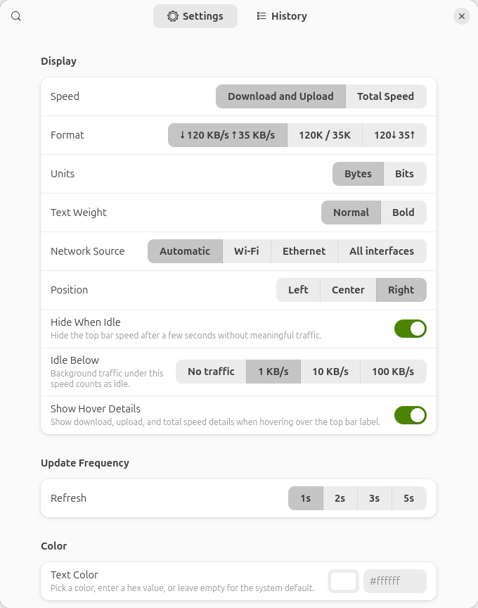
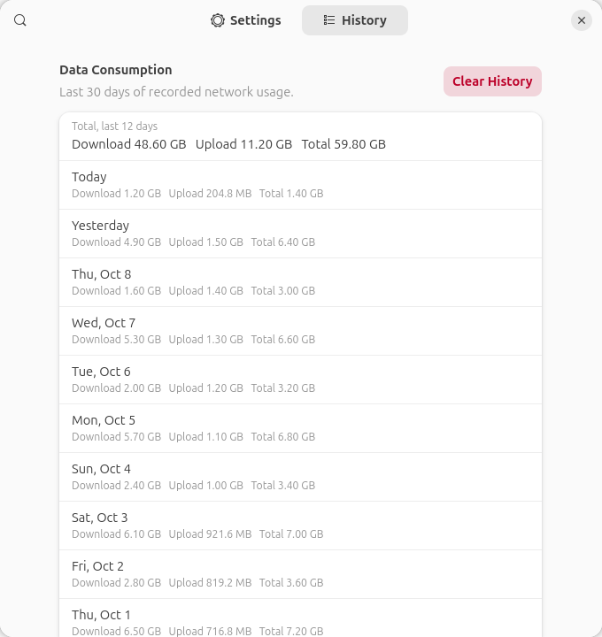

# FluxBar

Live network speed in your GNOME top bar.

FluxBar keeps your current upload and download speed visible without opening a system monitor. It is small, local, and designed to feel like it belongs in the panel.

```text
↓ 120 KB/s ↑ 35 KB/s
```

## Highlights

- See live download and upload speed in the GNOME top bar
- Switch between total speed and separate download/upload values
- Choose standard or compact speed text, including `120K / 35K` and `120↓ 35↑`
- Steady-width label: the top bar doesn't shift around as numbers change
- Hover the label for download, upload, and total speed details
- Click the label to see today's and the last 30 days' usage
- Display speeds in bytes or bits, from B/s up to GB/s
- Choose the network source: Automatic, Wi-Fi, Ethernet, or all real interfaces (mobile broadband included)
- Hide the label when idle, with an adjustable idle threshold so background chatter doesn't keep it visible
- Choose an update interval: 1, 2, 3, or 5 seconds
- Place it on the left, center, or right of the top bar
- Apply an optional custom text color and bold text
- Review daily usage for the last 30 days, with totals, and clear it any time
- Runs locally with no telemetry, network requests, or external services

## Screenshots

| Settings | History |
| --- | --- |
|  |  |

The preferences screenshots are generated from the real `prefs.js` with sample data by `make screenshots`.

## How It Works

FluxBar reads network counters from `/proc/net/dev`. By default, Automatic mode shows traffic from real Wi-Fi, Ethernet, and mobile broadband (WWAN or USB tethering) interfaces while ignoring loopback, Docker, bridge, VM, and other virtual adapters. You can also limit the speed reading to Wi-Fi or Ethernet, or combine all recognized real interfaces. Usage history is stored locally on your machine.

```text
~/.local/share/fluxbar/usage.json
```

## Install

FluxBar is on [extensions.gnome.org](https://extensions.gnome.org/extension/9789/fluxbar/) for GNOME Shell 45 to 50. Installing from there keeps it updated automatically.

- **Browser:** open the [FluxBar page](https://extensions.gnome.org/extension/9789/fluxbar/) and flip the switch. This needs the GNOME Shell integration browser add-on and the `gnome-browser-connector` package.
- **Extension Manager:** install [Extension Manager](https://flathub.org/apps/com.mattjakeman.ExtensionManager) from Flathub, search for **FluxBar** and click Install.
- **Terminal:** ask GNOME Shell to fetch it, then confirm the dialog:

  ```sh
  gdbus call --session \
      --dest org.gnome.Shell.Extensions \
      --object-path /org/gnome/Shell/Extensions \
      --method org.gnome.Shell.Extensions.InstallRemoteExtension \
      fluxbar@piyushdoorwar.github.io
  ```

Open FluxBar's settings from its top bar menu, or from the Extensions app.

### From source

```sh
git clone https://github.com/piyushdoorwar/fluxbar.git
cd fluxbar
make install
```

Then log out and back in (on X11, `Alt` + `F2`, `r`, `Enter` is enough) and enable it:

```sh
gnome-extensions enable fluxbar@piyushdoorwar.github.io
```

## Development

See [CONTRIBUTING.md](CONTRIBUTING.md) for the full development guide. In short, after changing source files, reinstall and reload the extension. A `Makefile` wraps the common tasks:

```sh
make reload   # sync sources, compile schemas, disable + enable
make logs     # follow GNOME Shell logs
make lint     # run ESLint (run `npm install` once first)
```

`make install` does the sync + schema compile without toggling the extension. The equivalent raw commands are:

```sh
rsync -a --delete --exclude='.git' ./ ~/.local/share/gnome-shell/extensions/fluxbar@piyushdoorwar.github.io/
glib-compile-schemas ~/.local/share/gnome-shell/extensions/fluxbar@piyushdoorwar.github.io/schemas
gnome-extensions disable fluxbar@piyushdoorwar.github.io
gnome-extensions enable fluxbar@piyushdoorwar.github.io
```

On some Ubuntu sessions, `journalctl --user -f` shows more than `make logs`.

## Package

Create the distributable zip:

```sh
make pack
```

This is equivalent to:

```sh
zip -r fluxbar@piyushdoorwar.github.io.zip metadata.json extension.js prefs.js utils.js schemas/org.gnome.shell.extensions.fluxbar.gschema.xml README.md LICENSE
```

The generated zip can be installed manually or prepared for review and distribution.

## Contributing and support

- Found a bug or have an idea? [Open an issue](https://github.com/piyushdoorwar/fluxbar/issues/new/choose).
- Want to contribute code? Start with [CONTRIBUTING.md](CONTRIBUTING.md).
- Security problem? See [SECURITY.md](SECURITY.md).
- Privacy: FluxBar collects nothing and makes no network requests. See the [privacy policy](https://fluxbar.piyushdoorwar.com/policy/).
- Enjoying FluxBar? You can [buy me a coffee](https://buymeacoffee.com/piyushdoorwar).

Website: [fluxbar.piyushdoorwar.com](https://fluxbar.piyushdoorwar.com)

## License

FluxBar is released under the [MIT License](LICENSE).
